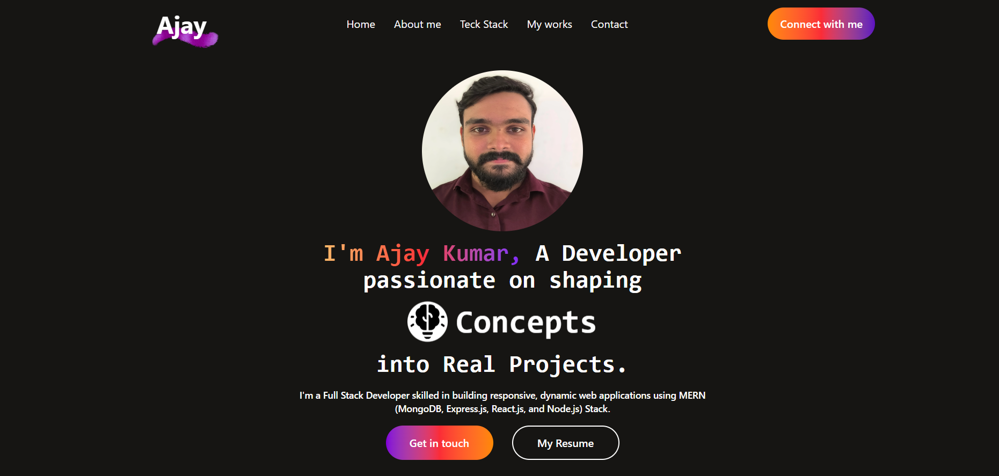

# 🌐 Ajay Kumar T P | Full Stack Developer

Welcome to my **Digital Portfolio**, a showcase of my work, skills, and projects as a **Full Stack Developer**.  
Built using **React**, **Tailwind CSS**, and **Node.js**, this portfolio highlights my passion for creating modern, responsive, and interactive web applications.

---

## 🚀 About the Project

This digital portfolio is designed to present my technical expertise, personal projects, and professional journey in a clean and user-friendly interface.  
It serves as both an introduction to my work and a reflection of my ability to build scalable and aesthetic web applications.

---

## ✨ Features

- 💻 Fully responsive design built with Tailwind CSS  
- ⚡ Smooth and interactive user experience using React  
- 🧩 Modular and reusable components  
- 🌙 Light, minimal, and developer-friendly design  
- 🔗 Quick access to my projects, resume, and contact details  

---

## 🛠️ Tech Stack

**Frontend:** React, Tailwind CSS    
**Deployment:** Render

---

## 🖼️ Screenshots / Demo

---

## 📁 Folder Structure

My-Portfolio/
├── src/
│   ├── components/
│   │   └── pages
│   ├── assets/
│   ├── App.jsx
│   ├── Main.jsx
│   └── index.css
├── public/
├── package.json
├── index.html
└── README.md
